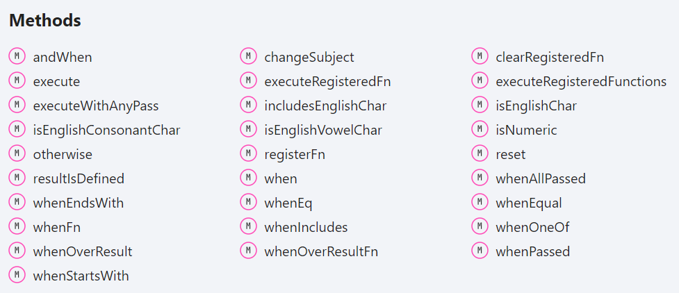

# ifless [![NPM version][npm-image]][npm-url]

> Get rid of if statements in your code by using convenient api

## Install

```sh
npm install ifless
```

or

```sh
yarn add ifless
```

## Usage

### Ifless

```javascript
import Ifless from 'ifless';

const ifless = new Ifless();
const result = ifless.when(() => false, 'foo').when(() => true, 'bar').result;
console.log(result); // bar
```

### IflessNumber

```javascript
import {IflessNumber} from 'ifless';

const iflessNumber = new IflessNumber(12);
const result = iflessNumber.whenLt(7, 'bar').whenGt(10, 'baz').result;
console.log(result); // baz
```

### IflessString

```javascript
import {IflessString} from 'ifless';

const iflessString = new IflessString('O. Henry - The Remnants of the Code');
const result = iflessString
	.whenStartsWith('Mark Twain', 'Author is Mark Twain')
	.whenStartsWith('O. Henry', 'Author is O. Henry')
	.whenStartsWith('Ernest Hemingway', 'Author is Ernest Hemingway').result;
console.log(result); // Author is O. Henry

// Reset previously performed conditions
// and run another ones without creating a new instance
const result2 = iflessString
	.reset()
	.whenOneOf(['lar', 'dor', 'qin'], 'one of [lar, dor, qin]')
	.whenIncludes('Remnants', 'includes Remnants')
	.whenStartsWith('Mark Twain', 'Starts with "Mark Twain"').result;
console.log(result2); // includes Remnants

const result3 = iflessString
	.reset()
	.whenEndsWith('Parade', 'Ends with "Parade"')
	.whenEndsWith('Code', 'Ends with "Code"')
	.whenEndsWith('Unfulfilment', 'Ends with "Unfulfilment"').result;

const result3 = iflessString
	.reset()
    .registerFn('containsHenry', (subject) => subject.includes('Henry'))
    .registerFn('endsWithCode', (subject) => subject.endsWith('Code'))
    .execute()
    .whenPassed('contains Henry and ends with Code')
    .result()
console.log(result2); // contains Henry and ends with Code
```

### IflessObject

```javascript
import {IflessObject} from 'ifless';

const iflessObject = new IflessObject({foo: 'bar'});
const result = iflessObject
	.when(source => source.foo === 'qux', 'foo is qux')
	.when(source => source.foo === 'bar', 'foo is bar')
	.when(source => source.foo === 'corge', 'foo is corge').result;
console.log(result); // foo is bar

// the same with simplfied notation
const iflessObject2 = new IflessObject({foo: 'bar'});
const result2 = iflessObject2
	.whenPathEq('foo', 'qux', 'foo is qux')
	.whenPathEq('foo', 'bar', 'foo is bar')
	.whenPathEq('foo', 'corge', 'foo is corge').result;
console.log(result2); // foo is bar

const iflessObject3 = new IflessObject({
	message: 'feat: symbolics keys with added optional to definition, optional tuples',
	author: {
		name: 'ShawnMorreau'
	},
	date: new Date(2023, 6, 25),
});
const occurenceToEmojMapping : any = {
	0: '✨',
	1: '🌟',
	2: '🚀',
};
const result = iflessObject3
	.whenPathSatisfies(
		'message',
		(value: string) => value.startsWith('feat:'),
		'is feature',
	)
	.andWhenPathEq('author.name', 'ShawnMorreau', 'is feature and author is ShawnMorreau')
	.andWhenPathSatisfies('date', (value: Date) => value > new Date(2024, 1, 1), 'is feature and author is ShawnMorreau and after 2024')
	.otherwise('other commit')
	.whenOverResultFn(
		(result: string) => result.includes('is feature'),
		(result) => `${occurenceToEmojMapping[(result.match(/and/ig) || []).length]} ${result}`)
	.result;
console.log(result); // 🌟 is feature and author is ShawnMorreau

const iflessObject4 = new IflessObject({foo: 'bar', bar: {baz: 'qux'}});
const result3 = iflessObject4
	.whenPathSatisfies(
		'foo',
		value => value.startsWith('ro'),
		'subject.foo starts with "ro"',
	)
	.whenHasKey('notExistingKey', 'has notExistingKey')
	.whenPathSatisfies(
		'bar.baz',
		value => value.endsWith('ux'),
		'subject.bar.baz ends with "ux"',
	).result;
console.log(result3); // subject.bar.baz ends with "ux"
```

## Screenshots

### IflessString methods



## License

MIT © [Rushan Alyautdinov](https://github.com/akgondber)

[npm-image]: https://img.shields.io/npm/v/ifless.svg?style=flat
[npm-url]: https://npmjs.org/package/ifless
